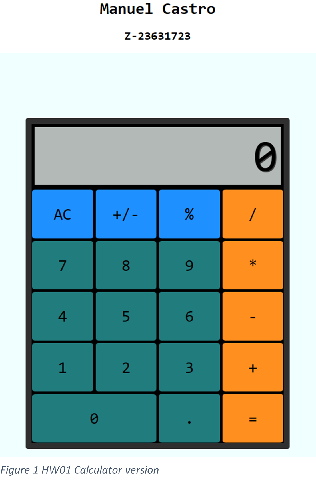
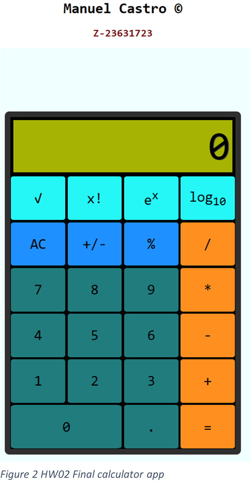

# Manuel Castro

## **GitHub username:** manuelcastroFau

### **Repo:**  https://github.com/cop4808-spring-2023-fullstack-web/cop4808-git-and-github-fundamentals-manuelcastroFau.git

---
---

# HW 02 Calculator 2

## Improvements to the calculator from HW 01
   
List of stories 

- [x] Square root functions
- [x] Factorial 
- [x] Contact the media
- [x] Euler number raised to x
- [x] Improve in the UI design 
   

Version of HW01            |  New Version HW02
:-------------------------:|:-------------------------:
  |   

## Gif of HW02 calculator

